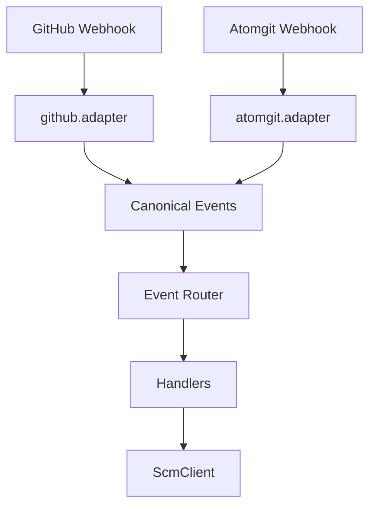

# GitHub + Atomgit 双 Webhook 接入：分层设计与落地说明

## 背景

r2cn-bot 最初围绕 **GitHub** 建设：通过 Probot 接收 Webhook，在 handler 中直接使用 `Context`、`context.payload` 与 `context.octokit` 完成标签、评论、任务 API 等流程。业务逻辑与 **GitHub 事件形态、REST 调用方式** 耦合在同一层，适合单一来源，但难以扩展。

当前正在把 bot **从「只处理 GitHub 消息」重构为「兼容多平台消息来源」**：除 GitHub 外，需接入 **Atomgit** 等平台的 Webhook 与 OpenAPI。各平台在验签算法、Header、事件名与 JSON 结构上不一致，若继续在 handler 内分支判断平台，维护成本与出错面会快速上升。

因此采用 **「多路 Webhook 接入 → 统一领域事件 → 同一套业务 handler → 按平台实现的 SCM 客户端」** 的分层方式：消息从「某一 SCM」进入，在边界被映射为与平台无关的 **Canonical 事件**；业务只认 Canonical 与 **`ScmClient`**，从而在不大改领域规则的前提下，支持多平台并行演进。

下文描述面向「GitHub + Atomgit 双 webhook」的具体重构方向：Webhook 只做接入与映射，业务依赖领域事件与 SCM 抽象，同一套 handler 由不同适配器喂入统一输入。

---

## 1. 总体原则

1. **Webhook 薄**：验签、解析、字段映射；不写业务规则（不判断 `r2cn-*` 标签、不拼业务文案）。
2. **业务与平台解耦**：业务只依赖 **Canonical 领域事件** + **`ScmClient` + `Config`**，不依赖 GitHub payload 形状或 Probot `Context` / 零散 `octokit` 调用。
3. **一套 handler，双入口**：GitHub 与 Atomgit 通过各自 **adapter** 产出相同 Canonical 类型，再进入同一 **router → handlers**。
4. **演进策略**：统一到 Canonical 命名（`issue_id` / `repo_id` / `mentor_login` 等）并补充 `scm_provider` / `external_ref`，避免平台耦合字段名（见第 7 节）。

---

## 2. 分层架构

```
┌─────────────────┐     ┌─────────────────┐
│ GitHub Webhook  │     │ Atomgit Webhook │
└────────┬────────┘     └────────┬────────┘
         │                       │
         ▼                       ▼
┌─────────────────────────────────────────┐
│  Adapters（验签、解析、映射）              │
│  github.adapter.ts / atomgit.adapter.ts │
└────────────────────┬────────────────────┘
                     ▼
┌─────────────────────────────────────────┐
│  Canonical Events（内部统一事件模型）    │
│  e.g. IssueLabeled, IssueCommentCreated │
└────────────────────┬────────────────────┘
                     ▼
┌─────────────────────────────────────────┐
│  Event Router（按事件类型分发）           │
└────────────────────┬────────────────────┘
                     ▼
┌─────────────────────────────────────────┐
│  Handlers（由 index.ts 等迁移）          │
│  只依赖 Canonical + ScmContext + Config  │
└────────────────────┬────────────────────┘
                     ▼
┌─────────────────────────────────────────┐
│  ScmClient（评论、标签、assignee 等）     │
│  GitHubScmClient / AtomgitScmClient      │
└─────────────────────────────────────────┘
```

等价 Mermaid（便于在 GitHub 上渲染）：



---

## 3. 内部统一模型（Canonical）

目标：把 Probot 的 `Context` 从 handler 中「挤出去」，handler 入参仅为自有类型 + `ScmClient` + `Config`（及日志/追踪等横切能力）。

### 3.1 建议核心类型（命名可按实现微调）

| 类型 | 说明 |
|------|------|
| **`RepoRef`** | `provider: 'github' \| 'atomgit'`、`owner`、`name`、`fullName`；可选各平台 `numericId`（用于后端 Canonical `repo_id`，见第 7 节）。 |
| **`Actor`** | `login`、`displayName?`、平台侧 user id（字符串或 bigint，按平台文档定）。 |
| **`IssueRef`** | 平台 issue id、`number`、`title`、`htmlUrl`（或 Atomgit 等价链接字段）。 |
| **`DeliveryMeta`**（可选） | `deliveryId`、`receivedAt`，用于日志与可选幂等。 |

### 3.2 事件示例（与当前代码对齐）

当前 [`src/index.ts`](../src/index.ts) 中：

- `app.on(["issues.labeled"], …)` → **`IssueLabeled`**：含 label 名、`issue`、`repo`、`actor`（若 payload 有）、`labels` 快照（用于「多个 r2cn-*」判断）。
- `app.on(["issue_comment.created"], …)` → **`IssueCommentCreated`**：含 `body`、`issue`、`repo`、`issueAuthor`（issue 作者）、`issueLabels`（用于认领标签等）、`actor`、`isBot`（对应现有 `context.isBot`）。

后续新增能力时，优先新增 Canonical 事件类型，而不是在 adapter 里写分支业务。

### 3.3 与现状的对应关系

| 现状 | 迁移后 |
|------|--------|
| `issues.labeled` 内联逻辑 | `onIssueLabeled(event, deps)`，`deps` 含 `scm`、`config`、`log` |
| `issue_comment.created` + `/request` `/intern` | `onIssueCommentCreated` → 再按命令分发到现有 `Student` / `Mentor` 模块（入参改为 Canonical + Scm，而非整颗 `Context`） |
| `fetchConfig` 内 `context.octokit.repos.getContent` | 可保留「从固定组织读配置」在 **GitHub 路径**；若 Atomgit 配置来源不同，通过 **ConfigLoader** 或 `ScmClient` 的只读接口抽象，避免 handler 直接绑 GitHub API |

---

## 4. Webhook 适配层

### 4.1 GitHub

- **选项 A**：保留 Probot 作为 HTTP 入口；在最早一层将 `context.payload` 转为 Canonical，调用 router。
- **选项 B**：自管 `POST /webhooks/github`（Express/Fastify）+ `@octokit/webhooks` 验签，再映射。

### 4.2 Atomgit

- 独立路由，例如 **`POST /webhooks/atomgit`**。
- 按 **Atomgit 官方文档** 验签（算法、Header 字段与 GitHub 不同）。
- 映射表：**Atomgit 事件名 / JSON 路径** → 内部 Canonical 类型；无法映射的：**打 debug 日志并返回 200 丢弃**，避免平台重试风暴。

### 4.3 适配器职责清单

- 验签；可选 IP 白名单。
- 解析 **delivery id**（或平台等价字段），写入日志；可选基于 delivery 的幂等缓存。
- 只做字段映射与最小校验（如 body 是否为 object）；**不**实现 `r2cn-*`、maintainer、任务状态机等规则。

---

## 5. SCM 抽象（替代到处 `context.octokit`）

### 5.1 接口职责（示例）

Handler 与领域服务只依赖接口，例如：

- `createIssueComment(repo, issue, body)`
- `removeLabel` / `removeAssignees`（[`src/student/`](../src/student/index.ts) 等已有 Octokit 调用应迁入实现类）
- 将来若需要「读 issue」： `getIssue(...)` 等同理放入接口

### 5.2 实现类

| 实现 | 说明 |
|------|------|
| **`GitHubScmClient`** | 内部持 Octokit / REST，实现上述接口。 |
| **`AtomgitScmClient`** | 调用 Atomgit OpenAPI；`baseUrl`、token 来自 env 或按 `RepoRef` 查配置表。 |

Router 或工厂根据 **`event.repo.provider`**（或 webhook 元数据）注入对应 `ScmClient`，handler 不分支判断平台。

---

## 6. 路由与进程部署

- **单进程双路径**：例如 `/webhooks/github`、`/webhooks/atomgit`，共享同一套 handler、配置加载与日志格式。

### 6.1 仓库内模块目录（建议）

在 `src/` 下按职责划目录，避免 webhook 与领域模型混在单文件里。以下为**建议布局**，实现时可微调文件名，但边界保持一致。

| 路径 | 职责 |
|------|------|
| `src/canonical/`（新建） | Canonical 类型：`RepoRef`、`Actor`、`IssueRef`、各事件 DTO、与平台无关的枚举常量。 |
| `src/config/` | 运行配置与共享类型：原 `common.ts` 中的 `Config` / `R2CN` / `BotComment`、后端 HTTP 封装 `fetchData` / `postData`、命令相关小工具等。 |
| `src/scm/`（新建） | `ScmClient` 接口、`GitHubScmClient`、`AtomgitScmClient`、工厂 [`createScmClient`](../src/scm/create-scm-client.ts)。 |
| `src/api/` | 后端 HTTP 附加字段：`scm_provider` / `external_ref` 等（[`scm-backend-payload.ts`](../src/api/scm-backend-payload.ts)，阶段 6）。 |
| `src/webhooks/` | `github-adapter.ts`、`map-github-to-canonical.ts`、`event-router.ts`、`github-webhook-log.ts`；后续 `atomgit.adapter.ts` 等。 |
| `src/handlers/` | `on-issue-labeled.ts`、`on-issue-comment-created.ts`（统一走 Canonical 入参与 `ScmClient`）。 |
| `src/task/`、`src/student/`、`src/mentor/` | 后端任务 API、学生/导师斜杠命令处理（各目录 `index.ts` 为入口）。 |
| 现有 [`src/index.ts`](../src/index.ts) | **Probot 注册**：`onAny` 日志 + `issues.labeled` / `issue_comment.created` → adapter → `dispatchCanonicalEvent`。 |

示意（非必须一字不差）：

```
src/
  canonical/     # 统一事件与引用类型
  config/        # Config / 文案类型、后端 API 封装（原 common）
  scm/           # ScmClient 接口与双平台实现
  webhooks/      # 适配器、验签、映射到 Canonical
  handlers/      # 业务 handler（可选独立目录）
  task/          # 任务后端 API 封装（index.ts）
  student/       # 学生命令（index.ts）
  mentor/        # 导师命令（index.ts）
  api/           # 调用 r2cn 后端 API 时的 SCM 元数据（可选字段）
  index.ts       # 进程入口 / Probot 挂载
```

### 6.2 请求日志字段约定

**每条进入 adapter 并成功解析为「可路由事件」的请求**（含映射后丢弃的 debug 路径，仍建议打一条摘要日志），日志上下文或结构化字段中应至少包含：

| 字段 | 说明 |
|------|------|
| **`provider`** | `'github' \| 'atomgit'`（与 `RepoRef.provider` 一致，便于检索）。 |
| **`deliveryId`** | 平台投递 id：GitHub 为 `X-GitHub-Delivery`；Atomgit 以官方文档为准。若某次请求无该字段，记为 **`unknown`** 或 **`none`**，**不得省略键**，便于日志 schema 稳定。 |
| **`eventType`** | **Canonical 事件名**（如 `IssueLabeled`、`IssueCommentCreated`）；未映射到 Canonical 时可为 **`unmapped`** 或 **`ignored`**，并附带平台原始事件名（见下行）。 |

**建议附加（可选但利于排障）**：`platformEvent`（平台原始事件名/ action）、`repoFullName`（若已解析）、HTTP `method` + `path`（自建路由时）。

**handler 内**日志建议在上述基础上带上业务键（如 `issueNumber`、`labelName`），仍不替代 webhook 层的 `provider` + `deliveryId` + `eventType`。

### 6.3 部署所需环境变量清单

按类别列出，便于与运维、CI、密钥管理对齐。**命名可与现有部署一致处优先沿用**；Atomgit 为新增能力，变量名可在实现前与团队统一。

#### 6.3.1 全平台 / 业务后端（已有）

| 变量 | 用途 | 备注 |
|------|------|------|
| **`API_ENDPOINT`** | r2cn 后端 HTTP API 根路径 | 代码中已用于 [`src/task/`](../src/task/index.ts)、[`src/student/`](../src/student/index.ts)、[`src/mentor/`](../src/mentor/index.ts) 等；部署示例见 [`.github/workflows/bot-deploy.yml`](../.github/workflows/bot-deploy.yml)（如 `http://r2cn-api:8000/api/v1`）。 |

#### 6.3.2 GitHub / Probot（当前部署已有）

与 [`.github/workflows/bot-deploy.yml`](../.github/workflows/bot-deploy.yml) 中 `docker run -e …` 对齐：

| 变量 | 用途 |
|------|------|
| **`APP_ID`** | GitHub App 应用 ID |
| **`PRIVATE_KEY`** | GitHub App 私钥（PEM，常为多行，注意容器/secret 转义） |
| **`WEBHOOK_SECRET`** | GitHub Webhook 签名校验密钥（Probot 默认使用该名） |
| **`GITHUB_CLIENT_ID`** | OAuth / App 客户端 ID（部署中为 `APP_CLIENT_ID` 注入） |
| **`GITHUB_CLIENT_SECRET`** | OAuth / App 客户端 Secret |

若后续改为自建 GitHub 路由而非 Probot 默认行为，可能增加 **`GITHUB_WEBHOOK_SECRET`** 作为别名或与 `WEBHOOK_SECRET` 统一文档说明，避免重复配置。

#### 6.3.3 Atomgit（新增，建议）

| 变量 | 用途 |
|------|------|
| **`PORTAL_ENDPOINT`** | Portal 服务根地址；按 owner 从 `/api/integration/open-source-orgs/webhook-tokens` 拉取 Atomgit webhook token 并缓存 |
| **`ATOMGIT_API_BASE`** | Atomgit OpenAPI 根 URL（例如 `https://api.atomgit.com/api/v5`，无尾斜杠）。发评论走 `POST /repos/:owner/:repo/issues/:number/comments`。 |
| **`ATOMGIT_TOKEN`** | 调用 Atomgit API 的 token（或按组织拆为多 token，再增加 `ATOMGIT_TOKEN_*`） |

#### 6.3.4 运维与对齐说明

- **密钥轮换**：`WEBHOOK_SECRET` 与平台控制台配置需同步更新；Atomgit webhook token 由 portal 维护。
- **文档维护**：实现落地后，将**最终**变量名与是否必填同步到 README 或运维 runbook；本文档第 6.3 节作为设计期清单，可与代码 `process.env` 使用处交叉引用。

---

## 7. 与现有后端 API 的关系

[`src/task/index.ts`](../src/task/index.ts)、[`src/student/index.ts`](../src/student/index.ts)、[`src/mentor/index.ts`](../src/mentor/index.ts) 已切换为 Canonical 语义字段（`issue_id`、`repo_id`、`issue_number`、`mentor_login`、`student_login`）：

- **当前实现**：Task API 请求体使用 Canonical 命名，并附带 **`scm_provider`** 与 **`external_ref`**（见 [`src/api/scm-backend-payload.ts`](../src/api/scm-backend-payload.ts)）。
- **联调前提**：后端需按新键解析请求，不再依赖旧 `github_*` 键。

### 7.1 字段重构前后对比

| 场景 | 修改前 | 修改后 |
|------|--------|--------|
| 任务主键 | `github_issue_id` | `issue_id` |
| 仓库主键 | `github_repo_id` | `repo_id` |
| Issue 序号 | `github_issue_number` | `issue_number` |
| 导师字段 | `mentor_github_login` / `github_mentor_login` | `mentor_login` |
| 学生字段 | `student_github_login` | `student_login` |
| Issue 标题 | `github_issue_title` | `issue_title` |
| Issue 链接 | `github_issue_link` | `issue_link` |

Bot 侧重构建议分步：**先** 双 webhook + Canonical + `ScmClient`；**再** 逐步收紧 API 契约。

---

## 8. 重构的步骤

详细的分阶段说明已迁移到归档文档：

- [重构阶段明细（归档）](./archive/dual-webhook-refactor-phases.md)

当前主文档仅保留结论与现状摘要：

- 阶段 0～6 的核心目标与验收已完成，并在第 6、7、9 节给出对应代码锚点。
- 现行 API 命名采用 Canonical 字段（如 `issue_id` / `repo_id` / `mentor_login`），并附带 `scm_provider` / `external_ref`。
- 后续新增能力优先在 Canonical 事件与 `ScmClient` 扩展，避免在 adapter/handler 内引入平台分支。

---

## 9. 附录：当前代码锚点（便于拆 PR）

| 区域 | 文件 | 说明 |
|------|------|------|
| labeled 业务 | [`src/handlers/on-issue-labeled.ts`](../src/handlers/on-issue-labeled.ts) | 已由 `dispatchCanonicalEvent` 调用 |
| 评论命令 | [`src/handlers/on-issue-comment-created.ts`](../src/handlers/on-issue-comment-created.ts) | 已由 `dispatchCanonicalEvent` 调用；`task == null` 时仍先发 `taskNotFound` 再处理命令的既有行为保留 |
| 配置与 HTTP 封装 | [`src/config/index.ts`](../src/config/index.ts) | 供 handler / `task` / `student` / `mentor` 引用；后续可与 `ConfigLoader` 对齐 |
| 任务 API | [`src/task/index.ts`](../src/task/index.ts) | 字段命名演进见第 7 节 |
| 学生命令 | [`src/student/index.ts`](../src/student/index.ts) | 逐步去掉对 `Context` 的依赖，改为 `ScmClient` |
| 导师命令 | [`src/mentor/index.ts`](../src/mentor/index.ts) | 与 `student` 对称；`Payload` 含 `scmProvider`（阶段 6） |
| SCM 工厂 | [`src/scm/create-scm-client.ts`](../src/scm/create-scm-client.ts) | `createScmClient({ provider: "github", octokit })` / `{ provider: "atomgit" }` |
| 后端 SCM 附加字段 | [`src/api/scm-backend-payload.ts`](../src/api/scm-backend-payload.ts) | `mergeBackendWithTask` 等，供 `task` / `student` / `mentor` 复用 |

---

## 10. 文档维护

- 实施过程中若 Canonical 命名或路由路径与本文不一致，**以代码为准**并回写本节与第 3、6 节。
- 与部署相关的 secret、URL 以运维/CI 配置为准，本文仅列建议项。
